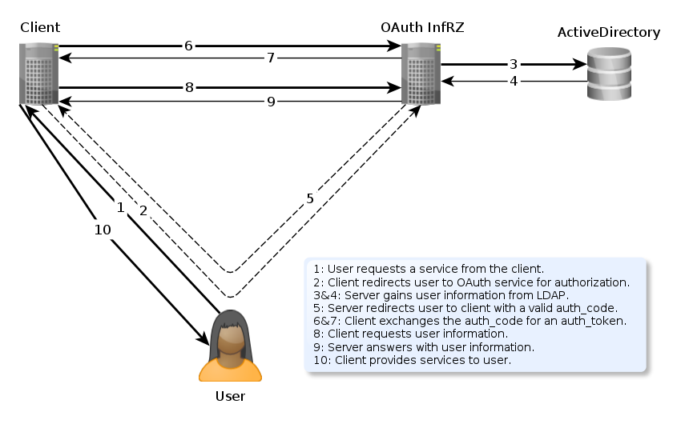

# OAuth-Infrz
Single-Sign-On solution for ActiveDirectory of "Informatik Rechenzentrum" at Uni Hamburg.

# OAuth
## How OAuth2 works
The following diagram and text explains *my* implementation of the OAuth2 protocol.
Although I have tried to conform to the protocols conventions the details to different implementations may vary.

1. The user wants to use a client site.
 * **GET** `https://client-site.org/service`
2. The client site informs the user about the authorization request and redirects her to the authorization request page on the OAuth2 Infrz site.
 * **GET** `https://my-oauth-server.edu/authorize?client_id={cid}&redirect_uri={ru}`
3. After the user logs in to the OAuth Infrz service, it confirms the users identity by checking his "Informatik Rechenzentrum" (*irz*) credentials against the *ActiveDirectory* (*LDAP*).
4. *LDAP* confirms the credentials and answers with the user information.
5. After the user has accepts the authorization on the OAuth Infrz site she is redirected to the client site passing an *auth_code* through a **GET** variable.
 * **GET** `https://client-site.org/client/redirect/page?code={auth_code}`
6. Now that the client has a valid *auth_code* it can exchange it for an *auth_token*.
 * **POST** `https://my-oauth-server.edu/authorize/token?grant_type={gt}client_id={cid}&client_secret={cs}&code={auth_code}&redirect_uri={ru}`
7. The server returns the client an *auth_token* as a *JSON* encoded object.
 * At this point it is proven to the client that the user has an *irz* account and therefore is a member of the department.
8. The client requests user information from the server with his *auth_token*.
 * **GET** `https://my-oauth-server.edu/user?oauth_token={auth_token}`
9. The server answers with the *JSON* encoded user object.
10. The client provides its services to the user.

# Installation
To install this package simply clone this project and set up a web-server. there is a sample nginx-config in the configs folder.

* **TODO: add sample nginx config**

## Dependencies
* __twig/twig__: _"1.*"_

### Installing dependencies
To install all dependencies, run `php composer.phar install` in your shell from the main directory.

# Valid Calls
## Web-Page
Web-Page calls return their information as a HTML web page.
Keep in mind that all url-values have to be *urlencoded* when passed. All POST-calls (except for "/login/authorize") must have a valid *page_token* set.
* **GET "/":** The main page with informational text.
* **GET "/login?redirect={r}":** The login form to be used with ActiveDirectory-Credentials.
 * *redirect*: The url to which the user is redirected after successful login.
* **POST "/login/authorize?username={un}&password={pw}&redirect={r}":** The login call, displaying status on login call and redirecting on success.
 * *username*: The infrz-alias ("Kennung") from the user.
 * *password*: The password to the Infrz account.
 * *redirect*: The url to which the user is redirected after successful login.
* **GET "/authorize?client_id={cid}&redirect_uri={ru}":** Authorize form displaying information about the client and scope.
 * *client_id*: The *client_id* of the client requesting an authorization.
 * *redirect_uri*: The url to which the user is redirected after successful permission grant.
 * The *response_type* variable (from the OAuth2 specification) is intentionally being ignored. The response-type at this stage is *code*.
* **POST "/authorize/grant?client_id{cid}&redirect_uri={ru}&scope={s}":** Displaying information about the access grant and redirecting to client-site with *auth_code*.
 * *client_id*: The *client_id* of the client requesting an authorization.
 * *redirect_uri*: The url to which the user is redirected after successful permission grant.
 * *scope*: The *scope* which was granted by the user.
* **GET "/client"**: The client overview displays a list of all clients the currently logged in user manages.
 * The client module (and all its actions) is only accessible if the user has permissions to manage clients.
* **GET "/client/new"**: The form to register a new client.
* **POST "/client/register?name={n}&description={d}&host={ħ}&redirect_uri={ru}&default_scope={ds}"**: The actual call to register a new client.
 * *name*: The name of the new client.
 * *description*: A brief description of the new client and its functionality/purpose.
 * *host*: The host from which the client calls are allowed (either IP or Hostname). Multiple hosts are separated with a comma.
 * *redirect_uri*: The url to which the user is redirected after authorization.
 * *default_scope*: The *scope* which the client is requesting by default.
* **GET "/client/_{id}"**: The object page to the *client* with the given id.
* **GET "/client/_{id}/edit"**: The edit page to the *client* with the given id.
* **POST "/client/_{id}/save?name={n}&description={d}&host={h}&redirect_uri={ru}&default_scope={ds}"**: The save action to the *client* with the given id.
 * *name*: The name of the new client.
 * *description*: A brief description of the new client and its functionality/purpose.
 * *host*: The host from which client calls are allowed (either IP or Hostname). Multiple hosts are separated with a comma.
 * *redirect_uri*: The url to which the user is redirected after authorization.
 * *default_scope*: The *scope* which the client is requesting by default.
* **POST "/client/_{id}/delete"**: Deletes the *client* with the given id.
* **POST "/client/_{id}/new_credentials"**: Generates und updates new client_id and client_secret (credentials).

## REST
REST calls return their information as a JSON encoded string.
* **POST "/authorize/token?grant_type={gt}client_id={cid}&client_secret={cs}&code={c}&redirect_uri={ru}"**: Returns a new authorization token ( *auth_token* ) if the call is valid.
 * *grant_type*: The *grant_type* (from Oauth2 specification) which is being used. The value has to be *authorization_code* or *refresh_token*.
 * *client_id*: The *client_id* from the requesting client.
 * *client_secret*: The *client_secret* mathing to the client_id.
 * *code*: Either the *verification code* from the user or a valid *refresh_token*, depending on *grant_type*-setting.
 * *redirect_uri*: The url to which the user gets forwarded after successful permission grant.
* **GET "/user?oauth_token={oat}"**: Returns the user-information.
 * *oauth_token*: The valid *oauth_token* from the client.

# Database Tables
SQLite3 is used as Database. The Database is saved in `oauth-infrz.sqlite3`.

## client
* **id**: INTEGER primary key
* **name**: varchar
* **user_id**: int
* **description**: text
* **client_id**: varchar unique
* **client_secret**: varchar
* **redirect_uri**: varchar
* **host**: varchar
* **default_scope**: varchar

## user
* **id**: INTEGER primary key
* **alias**: varchar unique
* **first_name**: varchar
* **last_name**: varchar
* **email**: varchar
* **groups**: varchar

## auth_token
* **id**: INTEGER primary key
* **user_id**: int
* **client_id**: int
* **token**: varchar unique
* **scope**: varchar
* **expires_at**: int

## auth_code
* **id**: INTEGER primary key
* **user_id**: int
* **client_id**: int
* **code**: varchar unique
* **scope**: varchar
* **created**: int

## refresh_token
* **id**: INTEGER primary key
* **auth_token_id**: int
* **token**: varchar unique
* **created**: int

## web_token
* **id**: INTEGER primary key
* **user_id**: int
* **token**: varchar unique
* **expires_at**: int

# TODO
* write How-Tos